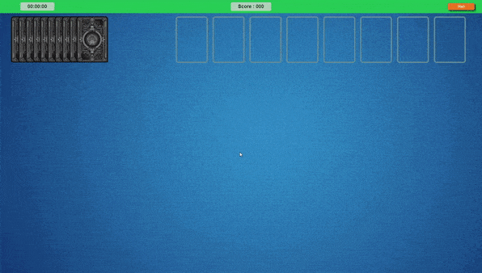
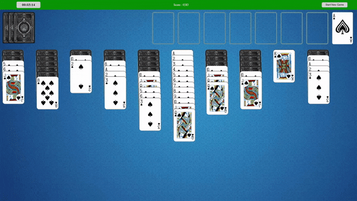
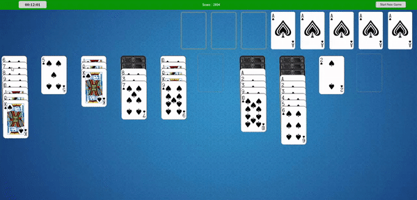
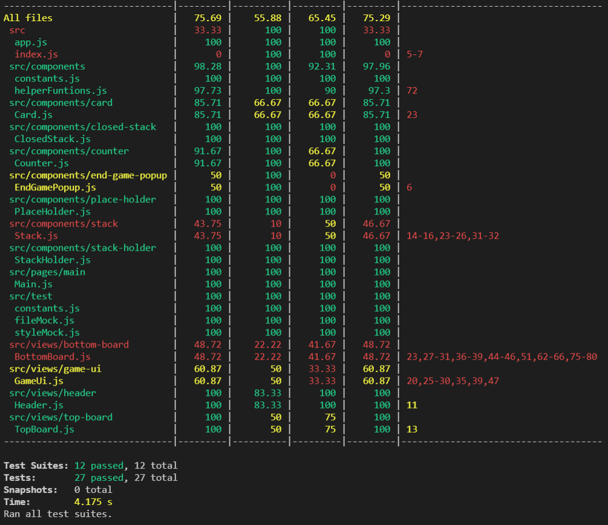
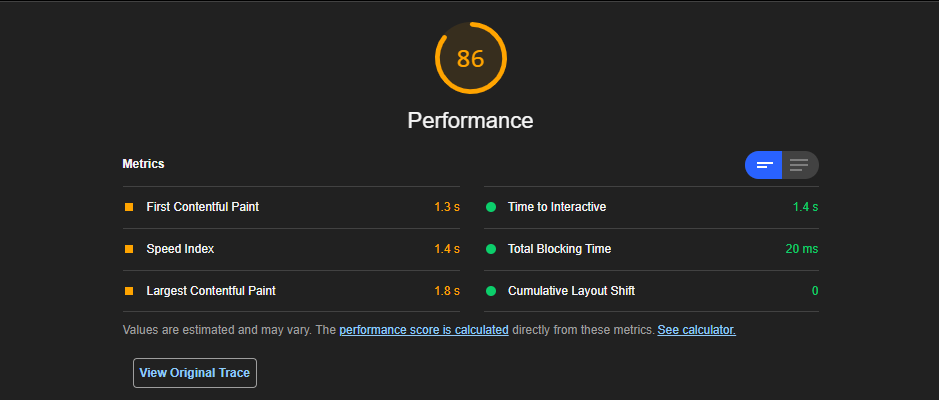

# Reversed Spider Solitaire Game,

[Reversed Spider Solitaire](https://final-project-cagri-koca.herokuapp.com/) It's a simple remake of classic Spider Solitaire Game built as the final project of Trendyol Front-End Bootcamp.

## Getting Started



## Goal
The goal of this solitaire game is to remove 8 columns of cards at the bottom, each ascending from Ace to King in a single suit. When a column like this is created it is automatically removed from the game freeing up space and opening up cards for you to continue.

## Setting up Reversed Spider Solitaire
Spider Solitaire is played with two decks of 52 cards with all jokers removed.

You will see at the start of the game that 10 columns are dealt at the top, with only the top card shown. You must rearrange the deal to uncover the cards underneath.

The first 4 columns of cards have 5 cards that are face down with the sixth card at the bottom dealt face up. The last 6 columns of cards have 4 cards dealt face down, with the fifth and final card on these columns dealt face up.

The rest of the cards remain in the deck to be used later.

## Rules of Reversed Spider Solitaire
The basic rules of spider solitaire are as follows. A single card can be moved onto a column if it is one higher than the card it is covering. When trying to move a column of cards, they can only be moved if they are all in the same suit. For this reason wherever possible it is best to create ascending columns of the same suit.

If a column is empty you can place anything on it. It is vitally important to use this well, as freeing up other options is exactly what this card game is about.

You can deal more cards to the layout by clicking the card located in the bottom right. These cards will cover all 10 columns, forcing you to rearrange them so you can reach any grouped columns you have created and arranged previously.

## Rules of Reversed Spider Solitaire 1 suit
To simulate this using a 2 standard decks of cards just assume that all cards belong to the same suit.
This means you can move any group of ascending cards onto another appropriate card. Any group of cards in perfect ascending order from Ace to King can be removed from play.
This version of Spider Solitaire is particularly easy, but it's quite relaxing!

## The game can be played with Dnd



## And game is also clickable



## Technologies Used

* React.js
* SCSS(need to refactor)
* Jest 
* CI/CD
* And some librariyes of these 

## Installation
- Clone project
```sh
git clone git@github.com:IbrahimCagriKoca/final-countdown.git
```

``` bash
# install dependencies
npm install

# Runs the app in the development mode.
# Open http://localhost:3000 to view it in the browser.
npm start

# The build is minified and the filenames include the hashes.
# App is ready to be deployed!
npm run build
```
## Unit Testing
- run unit tests
```sh
npm test

# We can also see all coverage of all app
npm test -- --coverage --wactchAll
```

## Project's test coverage 



## Project's performance on lighthouse


